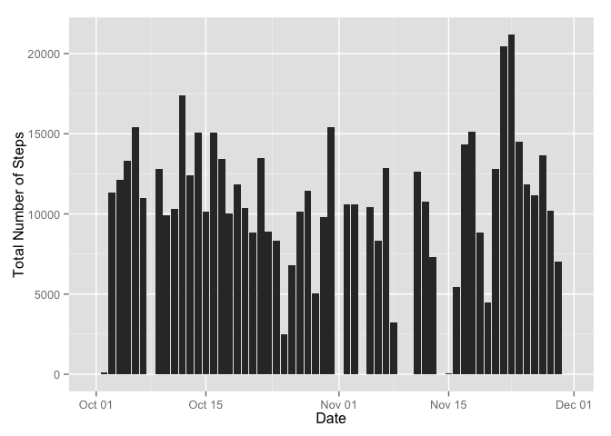
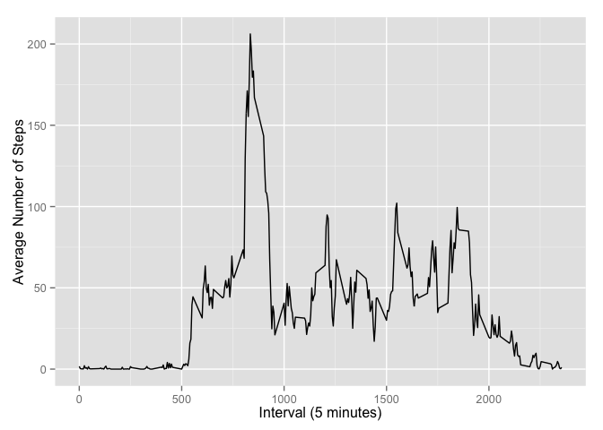
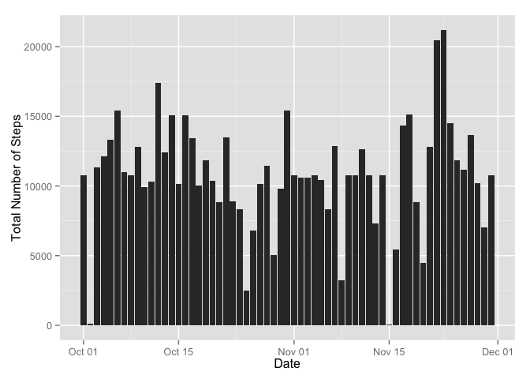
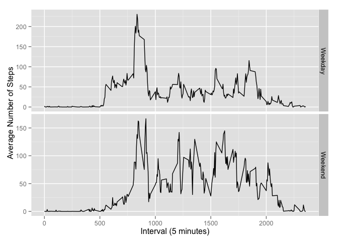

# Reproducible Research: Peer Assessment 1


## Loading and preprocessing the data

```r
library(dplyr)
library(scales)
library(ggplot2)
act_dat <- read.csv("./activity.csv")
names(act_dat) <- c('Steps', 'Date', 'Interval')
```
## What is mean total number of steps taken per day?

```r
sum_steps_d <- aggregate(act_dat['Steps'],
                         list(Date = act_dat$Date), 
                         sum, na.rm=TRUE)
sum_steps_d$Date <- as.Date(sum_steps_d$Date)

g <- ggplot(sum_steps_d, aes(Date, Steps))
g <- g + geom_bar(stat="identity")
g <- g + scale_x_date()
g <- g + labs(y='Total Number of Steps')
print(g)
```

 

```r
mean_step <- mean(sum_steps_d$Steps)
median_step <- median(sum_steps_d$Steps)
```
The mean and median total number of step per day is 9354.2295082 and 10395 respectively.
## What is the average daily activity pattern?

```r
avg_steps_i <- aggregate(act_dat['Steps'],
                         list(Interval = act_dat$Interval), 
                         mean, na.rm=TRUE)

g <- ggplot(avg_steps_i, aes(Interval, Steps))
g <- g + geom_line()
g <- g + labs(x='Interval (5 minutes)', y='Average Number of Steps')
print(g)
```

 

```r
max_steps <- avg_steps_i$Interval[which.max(avg_steps_i$Steps)]
```
The maximum average number of steps occured at the 835 minute interval.
## Imputing missing values

```r
na_cnt <- sum(is.na(act_dat$Steps))
```
The total number of missing values in the dataset is 2304.

```r
act_dat_c <- act_dat
for (i in avg_steps_i$Interval){
  act_dat_c$Steps[act_dat_c$Interval == i & is.na(act_dat_c$Steps)] <- 
    as.integer(round(avg_steps_i$Steps[avg_steps_i$Interval == i], 0))
}
```
Substitute missing values with the value averaged across days.

```r
sum_steps_d <- aggregate(act_dat_c['Steps'],
                         list(Date = act_dat_c$Date), 
                         sum, na.rm=TRUE)
sum_steps_d$Date <- as.Date(sum_steps_d$Date)

g <- ggplot(sum_steps_d, aes(Date, Steps))
g <- g + geom_bar(stat="identity")
g <- g + scale_x_date()
print(g)
```

 


```r
mean_step_c <- mean(sum_steps_d$Steps)
median_step_c <- median(sum_steps_d$Steps)

dif_mean_step <- mean_step_c - mean_step
dif_median_step <- median_step_c - median_step
```

The mean and median total number of steps per day is 1.0765639\times 10^{4} and 10762 respectively. Yes, there is a difference. The difference in mean and median total number of steps per day is 1411.4098361 and 367 respectively.

## Are there differences in activity patterns between weekdays and weekends?

```r
avg_weekend <- mutate(act_dat_c, 
                      Date = as.Date(Date), 
                      Weekend = 
                        ifelse(weekdays(Date) %in% c('Saturday', 'Sunday'), 
                           'Weekend', 'Weekday')) %>% 
  group_by(Interval, Weekend) %>% 
  summarize(Steps = mean(Steps))

g <- ggplot(avg_weekend, aes(Interval, Steps))
g <- g + facet_grid(Weekend ~ ., scales='free_y') 
g <- g + geom_line()
g <- g + labs(x='Interval (5 minutes)', y='Average Number of Steps')
print(g)
```

 

